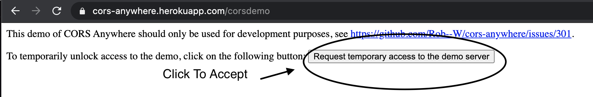

# Lost No More
Have you ever visited a city and felt lost, not know what to do? Well feel lost no more. With this user friendly application, you can view a map, top locations, and the forecast of the city searched. It uses [OpenWeather API](https://openweathermap.org/api) and two [Google API's](https://developers.google.com/places/web-service/search), to retrieve data for the inputed city. As avid travelers, we wanted to create an application that has a map, top sites, and weather.

url: https://obrienceob.github.io/LostNoMore/

## Table of Contents
---
* [Languages and Libraries](#Languages)
* [Installation](#Installation)
* [Usage](#Usage)
* [Credits](#Credits)
* [Authors](#Authors)
* [License](#License)

## Languages
---
* JavaScript
* HTML
* CSS

    Libraries used:
    * jquery
    * bulma
    * moment
    * fontawesome

## Installation 
--- 
In order to run the top sites for the city. Users must accept the cors proxy from cors-anywhere. At the following url:

url: https://cors-anywhere.herokuapp.com/

;

Once Accepted you will see a message at the end that says:
You currently have temporary access to the demo server. 

## Usage
---
When the user searches for a city, enter the city and click search. Then the map, five top site categories, and weather with a five day forecast will populate for that city.
 

 

 

 

Click on which top site category you would like to see, gyms, lodging, cafes, tourist attractions, and restaurants. 
When selected the top six sites will appear from that category. They will also populate on the map, which you can zoom in on.

 

 

When the user scrolls all the way down. The footer has a nice drop down menu with hyperlinks to each team members github page. Below is an icon for this repos github page.

 

 

## Credits
---
    The following tutorials were used: 
        * https://www.w3schools.com/howto/howto_css_modals.asp : used for modal 
        * https://github.com/Rob--W/cors-anywhere
        * https://www.w3schools.com/graphics/google_maps_intro.asp
        * https://developers.google.com/maps/documentation/javascript/overview
    
We used the herokuapp from github repository for our proxy url in order to work with google api's. We have a 90 day trial for google, to make this work correctly. 

## Authors
---

* [Amal Janabayev](https://github.com/Amal31497)
* [Conor O'Brien](https://github.com/obrienceob)
* [Danielle Orley](https://github.com/dorley1993)
* [Hanh Le](https://github.com/hanhle1989)
* [Sandu Corobcenco](https://github.com/SanduCorobcenco)

## License
---
Copyright © Team of Lost No More

Permission is hereby granted, free of charge, to any person obtaining a copy of this software and associated documentation files (the "Software"), to deal in the Software without restriction, including without limitation the rights to use, copy, modify, merge, publish, distribute, sublicense, and/or sell copies of the Software, and to permit persons to whom the Software is furnished to do so, subject to the following conditions:

The above copyright notice and this permission notice shall be included in all copies or substantial portions of the Software.

THE SOFTWARE IS PROVIDED "AS IS", WITHOUT WARRANTY OF ANY KIND, EXPRESS OR IMPLIED, INCLUDING BUT NOT LIMITED TO THE WARRANTIES OF MERCHANTABILITY, FITNESS FOR A PARTICULAR PURPOSE AND NONINFRINGEMENT. IN NO EVENT SHALL THE AUTHORS OR COPYRIGHT HOLDERS BE LIABLE FOR ANY CLAIM, DAMAGES OR OTHER LIABILITY, WHETHER IN AN ACTION OF CONTRACT, TORT OR OTHERWISE, ARISING FROM, OUT OF OR IN CONNECTION WITH THE SOFTWARE OR THE USE OR OTHER DEALINGS IN THE SOFTWARE.
